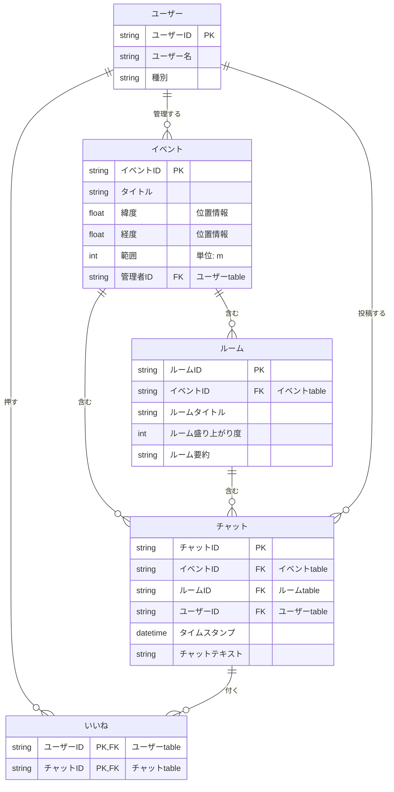

## 概要

地域住民やイベント参加者が、会場周辺の盛り上がりをマップ上で見つけ、その場にいる人同士でチャット（ルーム）を通じて交流できるサービス。マップでイベントを探し、参加してチャットルームに入り、AIによる要約・盛り上がり度の可視化で会話を追いやすくすることを目指す。

## 全体フロー

**一般ユーザー側**

1. マップからイベントを見つける
2. イベント場所で参加（join）
3. チャットルームを選択
4. チャットルームで会話

**管理者側**

1. イベントを作成・設定（位置情報／範囲／チャットルーム登録／その他情報）

## DB設計

`[P]` は主キー、`[ ]` は外部キー

**イベント**

- [P] イベントID
- タイトル
- 位置情報（緯度・経度）
- 範囲（m）
- 管理者ID [ユーザー]

**ルーム**

- [P] ルームID
- イベントID [イベント]
- ルームタイトル
- ルーム盛り上がり度
- ルーム要約

**チャット**

- [P] チャットID
- イベントID [イベント]
- ルームID [ルーム]
- ユーザーID [ユーザー]
- タイムスタンプ
- チャットテキスト

**いいね**

- [P] ユーザーID [ユーザー]
- [P] チャットID [チャット]

**ユーザー**

- [P] ユーザーID
- ユーザー名
- 種別

## API設計

### 共通仕様

- ベースURL: `/api/v1`（REST / JSON）
- 認証: `Authorization: Bearer <token>` を送る。一般ユーザーは匿名認証（`POST /users` で発行したトークンを localStorage に保存して再利用）、管理者のみログイン認証（`POST /admin/login`）
- ユーザーIDはトークンから特定する（リクエストボディでは受け取らない）
- 日時は ISO 8601 形式（例: `2026-07-04T14:00:00+09:00`）
- エラーレスポンスは共通形式: `{ "error": { "code": "NOT_FOUND", "message": "..." } }`

### エンドポイント一覧

| リソース | メソッド | パス                      | 説明                                         |
| -------- | -------- | ------------------------- | -------------------------------------------- |
| ユーザー | POST     | `/users`                  | 匿名ユーザー作成（トークン発行、認証不要）   |
| ユーザー | GET      | `/users/me`               | 自分のユーザー情報取得（トークン検証）       |
| ユーザー | POST     | `/admin/login`            | 管理者ログイン                               |
| イベント | POST     | `/events`                 | イベント作成（管理者のみ）                   |
| イベント | GET      | `/events`                 | イベント一覧取得（位置情報を元に）           |
| イベント | GET      | `/events/{eventId}`       | イベント取得                                 |
| ルーム   | POST     | `/events/{eventId}/rooms` | ルーム作成                                   |
| ルーム   | GET      | `/events/{eventId}/rooms` | ルーム一覧取得（ID・タイトル・盛り上がり度） |
| ルーム   | GET      | `/rooms/{roomId}`         | ルーム詳細取得（最新N件のチャット付き）      |
| ルーム   | GET      | `/rooms/{roomId}/chats`   | チャット一覧取得（ページネーション）         |
| ルーム   | POST     | `/rooms/{roomId}/analyze` | 盛り上がり度・要約の生成                     |
| チャット | POST     | `/rooms/{roomId}/chats`   | チャット投稿                                 |
| チャット | PATCH    | `/chats/{chatId}`         | チャット編集（本人のみ）                     |
| チャット | DELETE   | `/chats/{chatId}`         | チャット削除（本人のみ）                     |
| いいね   | PUT      | `/chats/{chatId}/like`    | いいねする（冪等）                           |
| いいね   | DELETE   | `/chats/{chatId}/like`    | いいね解除（冪等）                           |

認証まわりの要点：

- 匿名ユーザーは `userId` を名乗るだけだとなりすましできるため、サーバー署名付きトークン（JWTなど）を発行して照合する。localStorage が消えたら新しい匿名ユーザーとして作り直す（許容）。
- 管理者は `role: "admin"` のトークンを発行し、イベント作成などの管理操作を許可する。
- いいねはユーザーID×チャットIDの複合主キーのため、PUT/DELETEを冪等な操作にする（連打しても1いいねのまま）。

## 画面設計

**マップ画面**

- イベントの場所（ピン）、自分の位置、エリア（円で範囲表示）
- ピンの色と大きさで盛り上がりを表現、ピンを押すとイベント説明を表示
- 参加確認ボタン（匿名／非匿名を選択してチャット画面へ）
- 建物名・住所表示、場所／イベント検索、ルート、ズーム、ヒートマップ

**チャンネル（ルーム）選択画面**

- 横にルーム一覧を表示（ルーム名、現在の参加人数）
- 盛り上がっているルームを上位に表示

**チャット画面**

- 投稿時間・名前（ユーザーID）・アイコンを表示、入力スペース
- ボタンで話題の要約を表示、盛り上がり度を視覚的に表現、参加人数を表示
- リアクション／スタンプ／アナウンス機能、チャット履歴、写真投稿
- ライブ機能・スレッド機能・ダークモード（余裕があれば）

**利用イメージ**

1. マップ画面を表示
2. 自分の位置とイベントのピンを表示
3. エリア内に入ると参加確認画面が表示
4. チャンネル（ルーム）を選べる
5. チャットの表示
6. 要約を見れる
7. チャットを書く
8. 盛り上がる

## URL設計

**ホーム画面**

- `/map`（マップ）
- `/events`（イベント検索）
- `/profile`（プロフィール）

**イベント画面**

- `/{event_id}`（イベント詳細・ルーム一覧）

**チャット画面（ルーム）**

- `/{event_id}/{room_id}`

**管理者画面**

- `/admin/login`（管理者ログイン）
- `/admin`（管理者ダッシュボード・イベント一覧）
- `/admin/events/new`（イベント作成）
- `/admin/events/{event_id}`（イベント詳細・編集）
- `/admin/events/{event_id}/rooms`（ルーム管理）
- `/admin/events/{event_id}/participants`（参加者一覧確認）

## 想定使用技術

- フロントエンド: JavaScript / React / Tailwind CSS
- バックエンド: JavaScript ＋ フレームワーク（未定）
- デプロイ先: Vercel or Netlify
- DB / Redis: RDS, DynamoDB, Supabase のいずれか
- LLM API: OpenRouter, Google AI Studio
- OSS: OpenStreetMap など
